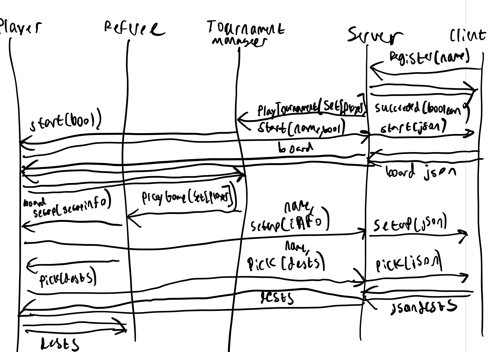
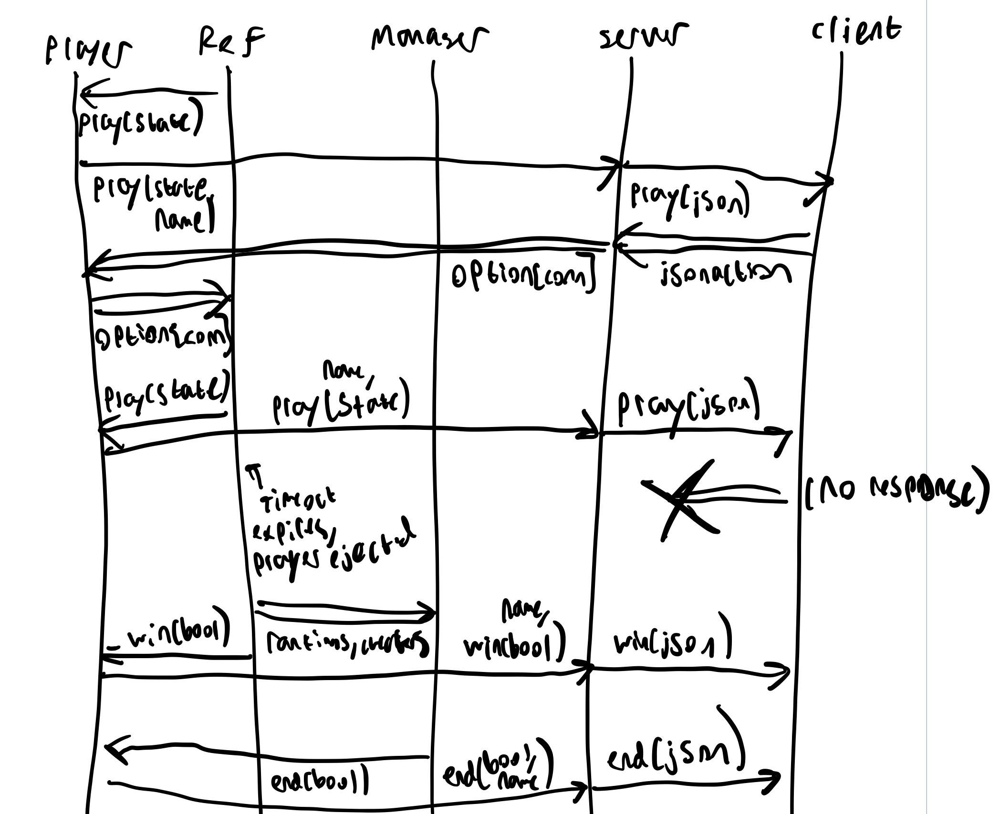

The first stage of communication is the setup stage. During this phase, a ``Client`` will register a name with the ``Server``. The ``Client`` receives a response from
the ``Server`` indicating whether the name they chose was already taken. If the name was not already taken, then a corresponding ``Player`` is constructed which serves as an interface between the ``Server`` and admin components. When enough players have registered, the ``Server`` begins a tournament. The tournament manager then notifies each ``Player`` that the tournament is starting using the ``start`` method on a ``Player``. Each ``Player`` forwards this message along with their name to the ``Server``, which then converts the message to JSON and sends it to the corresponding ``Client``. Each ``Client`` will respond with a ``Board`` to the ``Server`` in an appropriate JSON format. The ``Server`` converts each message back into our internal data representation and sends to it to each corresponding ``Player``. Finally, each ``Player`` sends the ``Board`` back to the ``Manager``. This pattern of forwarding information through the ``Player`` is repeated for every type of communication with the admin components.

In the case of the ``Client`` taking too long to respond, then the ``Referee`` will detect this timeout, and remove them from the game. If a ``Client`` attempts to send a message to the ``Server`` out of turn, the message is ignored. 

During the tournament/gameplay and end-game phase, communications follow the same pattern established above and demonstrated in the diagrams below. 

### Setup


### Gameplay and End


The JSON format for any request from a ``Client`` to the ``Server`` is as follows:
```json
{
  "name" : "player's unique name",
  "method": "some method name",
  "params":  {
    "example param name" : "example param value",
    "example param name2" : "example param value2"
  }
}
```

Any response from a ``Client`` to the ``Server`` will be formatted as follows:

```json
{
  "name" : "player's unique name",
  "result" : {
    "destinations" : ["name1","name2"]
  },
  "error" : "true/false"
}
```

Any request/response from the ``Server`` to a ``Client`` follows the same format, but does not specify the ``name`` field. 
All JSON parameters and results are formatted according to the specifications from prior assignments (ex: a ``Destination`` is a ``[Name, Name]``)

